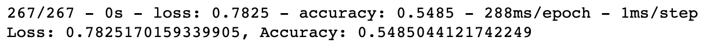

# Neural_Network_Charity_Analysis

## Overview
The purpose of this analysis is to attempt to bulid a neural network model that will predict with at least 75% theoretical accuracy if a charity will successfully use its funds. To accomplish this, 

- The original dataset is loaded into a Pandas DataFrame.
- The data is simplified by removing unnecessary data and binning rare occurances.
- Categorical variables are encoded using OneHotEncoder so they can be interpreted by the model.
- The data is sacled and split into training and testing sets.
- A sequential Keras model is built using the Tensor Flow library. 
- The model is run, its perofromance is measured, and its weights are tracked and saved.

## Results
### Data Preprocessing 
The target variable for this model is located in the "IS_SUCCESSFUL" column. This tells us whether or not the campaing in question was succesful, which is what we are trying to predict. The features include all of the data that may be useful in predicting the success of the campaign. In the initial model, this includes all columns other than "IS_SUCCESSFUL" (the target varaible), "NAME" and "EIN." The name and EIN of each recepient are consider to be neither targets nor variables, so those columns are dropped. 

### Compiling, Training, and Evaluating the Model

As seen in the above screenshot, the initial model used one input layer, two hidden layers, and one output layer. The number of neurons in the first hidden layer was set to three times the number of inputs, following best practices. The number of neurons in the second layer was set to half the number of neurons in the first hidden layer, also following best practices. To start, the activation function for both hidden layers is sit to Rectified Linear Unit ("ReLU") function because that is the one with which I have the most successful experience. The activation function on the output layer is set to sigmoid because the goal of the model is to predict one of two possible outcomes. 

### Model Optimization
I was not able to achieve the target model performance of 75% accuracy. The initial model performed the best out of all of them, with the below results, including 73.2% accuracy.

#### Optimization Attempt 1
This attempt binned the items in the "ASK_AMT" column and removed outliers. Then a model was run with the same parameters as the initial model because that model perofrmed very close to the target. This attempt performed worse than the initial model, with an accuracy of 54.9%. 

#### Optimization Attempt 2
This attempt removed "ASK_AMT" column completely on the premise that the amount of money requested may not mean much or even represent the amount of money that was awarded. Then a model was run with the same parameters as the initial model because that model perofrmed very close to the target. This attempt performed worse than Attempt 1, with an accuracy of 54.3%.

#### Optimization Attempt 3
Because the previous attempts performed so much worse than the initial model, the "ASK_AMT" column was reintroduced to the data in its entirety. Thinking that I could possibly achieve the slight improvement that I needed by changing the model itself around a little bit, I went to [TensorFlow Playground](https://playground.tensorflow.org/#activation=tanh&batchSize=10&dataset=circle&regDataset=reg-plane&learningRate=0.03&regularizationRate=0&noise=0&networkShape=4,2&seed=0.41988&showTestData=false&discretize=false&percTrainData=50&x=true&y=true&xTimesY=false&xSquared=false&ySquared=false&cosX=false&sinX=false&cosY=false&sinY=false&collectStats=false&problem=classification&initZero=false&hideText=false) and started working with different ideas. After this, I decided to keep the neurons and layers the same but to change the activation function in the hidden layers from ReLU to tanh. This attempt performed better than both previous attempts yet still slightly worse than the initial model, with an accuracy score of 72.4%.

## Summary
Although the initial model performed very close to the target accuracy of 75%, the key to reaching that goal was not found in these three optimization attempts. A different model may change the number of hidden layers or the number of neurons in each layer. Additionally, ther may still be input variables that are not true features and need to be removed from the dataset. One of these may be the "APPLICATION_TYPE" column. Additionally, a neural network may not be the best type of model for this particular problem or dataset. Random Forest models function much like machine learning models, but they may be less prone to overfitting. Perhaps a properly configured Random Forest model will perform better in this situation.

